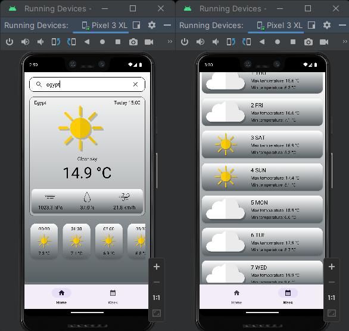

# Weather Forecast app 

## Intro

This is an Android application, it will help you to always be aware of weather conditions and plan your day according to the forecast.

## Functionality:

 - View current weather conditions in the selected city.
 - Get a forecast for 7 days ahead.
 - Display of temperature, humidity, wind speed and other meteorological parameters.
 - Automatic data update once a day.
 - Offline access to cached weather information.

## Technologies and Tools Used

- Android Studio
- Kotlin
- Retrofit for network request
- [Open-Meteo API](https://open-meteo.com/en/docs)
- [Geocoding API](https://open-meteo.com/en/docs/geocoding-api)
- Room for local storage
- WorkManager for task scheduling

## Appearance

